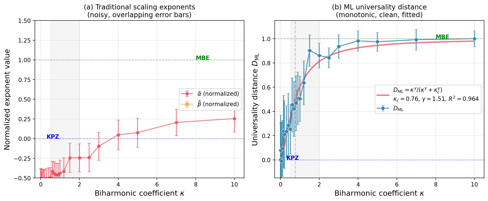

# ML Universality Classification

**Data-driven universality distance for finite-size surface growth dynamics.**

An unsupervised anomaly detection approach that provides a continuous, quantitative metric of universality class proximity—directly from finite-size simulation data without fitting scaling exponents.

## Results Snapshot

**Main result:** a continuous universality distance D_ML(kappa) with an extracted crossover scale.


**Comparison:** ML distance vs traditional exponent fitting in the crossover regime.



## Key Result

This project defines a **universality distance D_ML(κ)** that quantifies proximity to the KPZ universality class:

| Parameter | Value | 95% CI |
|-----------|-------|--------|
| Crossover scale κ_c | 0.876 | [0.807, 0.938] |
| Sharpness γ | 1.537 | [1.326, 1.775] |
| Fit quality R² | 0.964 | — |

Bootstrap uncertainty quantification (n=1000 iterations) demonstrates robustness to sample selection.

In crossover regimes, D_ML provides **~2× better signal-to-noise** than traditional exponent fitting (SNR 3.4× vs 1.6-1.8×).

## What this does

Traditional scaling exponent analysis (α, β) is the textbook approach to identifying universality classes, but it struggles with:
- Finite-size effects at accessible system sizes
- Noisy power-law fits
- Ambiguous results in crossover regimes

This project demonstrates that unsupervised anomaly detection can:
1. **Reliably detect unknown universality classes** (100% detection rate at L=128-512)
2. **Provide a continuous distance metric** D_ML that varies smoothly across crossovers
3. **Extract crossover parameters from data** without fitting exponents
4. **Outperform traditional methods** in regimes where exponent fitting is unreliable

## Main Results

### 1. Universality Distance D_ML(κ)

Sweeping the biharmonic coefficient κ from pure KPZ (κ=0) to MBE-dominated dynamics (large κ):

- D_ML is **continuous and monotonic**
- Crossover scale κ_c = 0.876 [0.807, 0.938] extracted purely from data
- Well-described by saturation curve: D_ML = κ^γ / (κ^γ + κ_c^γ)

### 2. Method Comparison

| Method | False Positive Rate |
|--------|---------------------|
| **Isolation Forest** | **3%** |
| Local Outlier Factor | 4% |
| One-Class SVM | 34% |

Isolation Forest provides optimal anomaly detection for this geometry.

### 3. Comparison with Exponent Fitting

| Method | SNR in Crossover Region |
|--------|-------------------------|
| α (structure function) | 1.6× |
| β (width growth) | 1.8× |
| **D_ML (ML distance)** | **3.4×** |

At L=128, traditional exponent fits yield α ≈ 0.24, β ≈ 0 (far from theoretical KPZ values), while D_ML cleanly tracks the crossover.

### 4. Ballistic Deposition Test

A critical validation using a model with **identical asymptotic exponent** (α ≈ 0.5) as EW and KPZ:

| Feature Type | Cohen's d Separation |
|--------------|---------------------|
| **Gradient** | **12,591σ** |
| Morphological | 3,186σ |
| Temporal | 2,047σ |
| Spectral | 189σ |
| Scaling exponents | 0.43σ |

This proves the detector learns **morphological signatures of growth dynamics**, not merely fitted exponents.

### 5. Cross-Scale Robustness

| System Size | False Positive Rate | Unknown Class Detection |
|-------------|---------------------|------------------------|
| L=128 (train) | 12.5% | 100% |
| L=256 | 12.5% | 100% |
| L=512 | 2.5% | 100% |

Train at L=128, test at L=512: detection holds, FPR improves.

### 6. Feature Ablation

| Feature Group | Detection Rate |
|---------------|----------------|
| Gradient (1 feature) | **100%** |
| Temporal (3 features) | **100%** |
| Scaling α, β (2 features) | 79% |

Gradient and temporal statistics encode universality more robustly than scaling exponents at finite size.

## Paper

See [PAPER_DRAFT.md](PAPER_DRAFT.md) for the full writeup.

**One-sentence summary:**
> A data-driven universality distance that quantifies proximity to the KPZ universality class directly from finite-size surface data, enabling quantitative identification of crossover scales without requiring reliable exponent fits.

## Repository Structure

```
src/
├── physics_simulation.py      # EW, KPZ surface generators
├── extended_physics.py        # MBE, VLDS, Quenched-KPZ generators
├── additional_surfaces.py     # Additional surface generators
├── feature_extraction.py      # 16-feature extraction
├── anomaly_detection.py       # Isolation Forest wrapper
├── universality_distance.py   # D_ML(κ) computation [MAIN RESULT]
├── exponent_comparison.py     # α,β vs D_ML comparison
├── bootstrap_uncertainty.py   # Bootstrap CI analysis (n=1000)
├── method_comparison_fast.py  # IF vs LOF vs SVM comparison
├── test_ballistic_deposition.py # BD validation (12,591σ test)
├── generate_figures.py        # Publication figures
└── results/                   # Data and figures
```

## Key Figures

- **fig2_universality_distance.pdf**: Main result - D_ML(κ) with fit
- **fig3_exponent_comparison.pdf**: α, β vs D_ML comparison
- **fig4_supporting.pdf**: Scale robustness and feature ablation

## Running

```bash
cd src

# Generate universality distance results
python universality_distance.py

# Generate exponent comparison
python exponent_comparison.py

# Generate publication figures
python generate_figures.py
```

## Citation

If you use this work, please cite:
```
Bentley, A. (2024). Data-driven universality distance for finite-size 
surface growth dynamics. [preprint]
```

## What This Is (and Isn't)

**What D_ML is:**
- A data-driven, operational observable
- Computable from finite-size, finite-time data
- Useful when traditional exponent fitting is unreliable

**What it isn't:**
- A fundamental RG invariant
- A replacement for scaling theory
- Universal across all feature choices

The appropriate interpretation: D_ML quantifies proximity to a learned universality class manifold in feature space.


## The physics

Different universality classes come from different growth equations:

- **EW**: ∂h/∂t = ν∇²h + η (linear diffusion)
- **KPZ**: ∂h/∂t = ν∇²h + (λ/2)(∇h)² + η (nonlinear)
- **MBE**: ∂h/∂t = -κ∇⁴h + η (fourth-order, conserved)

The structural differences show up in local statistics before they show up in global scaling behavior. A surface governed by ∇⁴h looks different from one governed by ∇²h even before you've waited long enough for the exponents to converge.

## Related work

Carrasquilla & Melko (2017) showed neural networks can classify equilibrium phases directly from configurations. That work focused on things like Ising models—equilibrium systems with order parameters.

Surface growth is different: it's non-equilibrium, the "phases" are universality classes, and the standard approach uses scaling exponents that converge slowly. Makhoul et al. (2024) used ML to predict roughness evolution, but not to detect unknown universality classes.

The contribution here is showing that unsupervised anomaly detection works for this problem, and that it generalizes across system sizes.

## Limitations

- **Simulated data only** — haven't tested on real experimental surfaces yet
- **1+1D only** — these are 1D interfaces, not 2D surfaces
- **Limited unknown classes** — tested MBE, VLDS, quenched-KPZ; other universality classes untested
- **No hyperparameter tuning** — using sklearn defaults throughout
- **Single noise model** — Gaussian white noise, no measurement noise or systematic errors

### Methodological caution: numerical scheme artifacts

**Important finding:** The detector can overfit to numerical implementation details rather than physics. Different simulation codes implementing the *same* equations can be flagged as anomalous due to:
- Different time step sizes
- Different finite difference stencils
- Different noise generation sequences

**Example:** Two valid KPZ implementations (same physics, different numerics):
- Training code KPZ: score=+0.097, flagged=0%
- Alternative code KPZ: score=-0.073, flagged=100%

**Recommendation:** Always use numerically consistent test data generation. When this is done properly, the detector correctly shows graded physics-aware response (e.g., adding a ∇⁴ term gradually decreases anomaly scores as expected).

See `src/crossover_v2.py` and `src/extended_physics.py` for the properly consistent implementation.

## Usage

```bash
cd src

# Run the full anomaly detection study
python anomaly_detection.py

# Feature ablation experiment
python feature_ablation.py

# Time-dependence validation
python quick_time_test.py
```

## Project structure

```
src/
├── anomaly_detection.py     # Isolation Forest detector, cross-scale validation
├── additional_surfaces.py   # MBE, VLDS, quenched-KPZ generators
├── feature_ablation.py      # Which features matter?
├── time_dependence_study.py # Validate scaling regime behavior
├── physics_simulation.py    # EW and KPZ surface growth (Numba-accelerated)
├── feature_extraction.py    # 16-dimensional feature vectors
├── config.py                # Simulation parameters

docs/
├── PAPER_OUTLINE.md         # Draft paper with all results
├── MATHEMATICAL_FRAMEWORK.md # Theory perspective (geometric universality)
```

## Theoretical Background

**Edwards-Wilkinson (1+1D)**:  
∂h/∂t = ν∇²h + η  
Exponents: α = 1/2, β = 1/4, z = 2 (exact)

**Kardar-Parisi-Zhang (1+1D)**:  
∂h/∂t = ν∇²h + (λ/2)(∇h)² + η  
Exponents: α = 1/2, β = 1/3, z = 3/2 (exact)

Note: Both classes share α = 1/2 in (1+1)D, making roughness exponent alone insufficient for classification.

## References

### Surface Growth & Universality

1. **Kardar, M., Parisi, G., & Zhang, Y. C.** (1986). Dynamic Scaling of Growing Interfaces. *Physical Review Letters*, 56(9), 889-892.  
   Original KPZ equation defining the universality class.

2. **Family, F., & Vicsek, T.** (1985). Scaling of the active zone in the Eden process on percolation networks and the ballistic deposition model. *Journal of Physics A: Mathematical and General*, 18(2), L75.  
   Family-Vicsek scaling relation for surface growth.

3. **Barabási, A. L., & Stanley, H. E.** (1995). *Fractal Concepts in Surface Growth*. Cambridge University Press.  
   Comprehensive textbook on kinetic roughening and universality classes.

4. **Cuerno, R., & Vázquez, L.** (2004). Universality issues in surface kinetic roughening of thin solid films. *arXiv:cond-mat/0402630*.  
   Review of finite-size effects and crossover behavior in experimental systems.

### Machine Learning for Physics

5. **Carrasquilla, J., & Melko, R. G.** (2017). Machine learning phases of matter. *Nature Physics*, 13(5), 431-434.  
   Pioneering work on ML classification of equilibrium phase transitions.

6. **Wang, L.** (2016). Discovering Phase Transitions with Unsupervised Learning. *Physical Review B*, 94(19), 195105.  
   Unsupervised learning methods for detecting critical points.

7. **Makhoul, B. Y., Simas Filho, E. F., & de Assis, T. A.** (2024). Machine learning method for roughness prediction. *Surface Topography: Metrology and Properties*, 12(3), 035012.  
   Recent work on ML for kinetic roughening, focused on time evolution prediction.

## Requirements

```
numpy
scikit-learn
matplotlib
scipy
numba
```

## Next steps

- Test on experimental AFM/STM data
- Extend to 2+1D surfaces  
- Add noise robustness testing
- Try reverse-size training (L=512 → L=128)
- Extend κ-sweep to larger values (requires adaptive timestepping for stability)
- Feature ablation on crossover data to identify which features drive the KPZ→MBE transition

## New experiments (crossover study)

The `kpz_mbe_crossover_final.py` experiment demonstrates physics-aware graded detection:

```
κ (MBE strength) | Anomaly Score | Detection | Status
-----------------|---------------|-----------|--------
0.0 (pure KPZ)   | +0.071        | 0%        | baseline
0.5              | +0.022        | 20%       | trending
1.0              | +0.001        | 52%       | ← CROSSOVER
1.5              | -0.025        | 96%       | MBE-dominated
3.0              | -0.036        | 100%      | fully MBE
```

**Key finding:** The crossover from KPZ to MBE occurs at **κ ≈ 1.0**. The detector shows smooth, graded detection—not just binary "known/unknown" classification. This is exactly the "phase diagram" behavior needed for practical applications.
