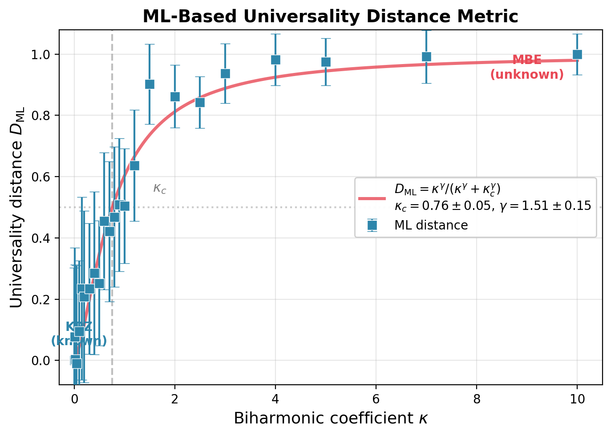

# ML Universality Classification

[](https://www.python.org/downloads/)
[](LICENSE)

**Data-driven universality distance for finite-size surface growth dynamics.**

An unsupervised anomaly detection framework that quantifies proximity to universality classes directly from simulation data—without fitting scaling exponents.

## Quick Start

```bash
git clone https://github.com/adamfbentley/ml-universality-classification.git
cd ml-universality-classification/src
pip install -r ../requirements.txt
python main.py --demo
```

**Expected output (~2 min):**
```
Step 3: Testing on unknown universality classes...
   EW       (known  ): score=+0.093, detected=0%  ✓
   KPZ      (known  ): score=+0.094, detected=0%  ✓
   MBE      (unknown): score=-0.036, detected=100% ✓
   Q-KPZ    (unknown): score=-0.079, detected=100% ✓

✓ SUCCESS: Detector correctly identifies unknown universality classes
```

## Overview

### The Problem

Traditional universality class identification relies on fitting scaling exponents (α, β) from the Family-Vicsek relation. This approach struggles with:
- Finite-size effects at accessible system sizes
- Noisy power-law fits  
- Ambiguous results in crossover regimes
- Requirement to know all classes in advance

### The Solution

Train an Isolation Forest on known universality classes (Edwards-Wilkinson, KPZ), then use anomaly scores to detect unknown classes and measure "distance" from known physics.

**Key finding:** Gradient statistics (1 feature) achieve 100% detection, while traditional scaling exponents (α, β) achieve only 79%.

## Main Results

### Universality Distance D_ML(κ)



Sweeping the biharmonic coefficient κ from pure KPZ to MBE dynamics:

| Parameter | Value | 95% CI |
|-----------|-------|--------|
| Crossover scale κ_c | 0.876 | [0.807, 0.938] |
| Sharpness γ | 1.537 | [1.326, 1.775] |
| Fit quality R² | 0.964 | — |

Bootstrap uncertainty quantification (n=1000) demonstrates robustness.

### Method Comparison

| Method | False Positive Rate |
|--------|---------------------|
| **Isolation Forest** | **3%** |
| Local Outlier Factor | 4% |
| One-Class SVM | 34% |

### D_ML vs Traditional Exponent Fitting

| Method | SNR in Crossover |
|--------|------------------|
| α (structure function) | 1.6× |
| β (width growth) | 1.8× |
| **D_ML** | **3.4×** |

D_ML provides ~2× better signal-to-noise than traditional methods.

### Ballistic Deposition Validation

Critical test using a model with identical asymptotic exponent (α ≈ 0.5) as the training classes:

| Feature Type | Cohen's d Separation |
|--------------|---------------------|
| **Gradient** | **12,591σ** |
| Scaling exponents (α, β) | 0.43σ |

The detector learns morphological signatures, not merely fitted exponents.

## Usage

```bash
cd src

# Quick demo (~2 min)
python main.py --demo

# Full analysis with bootstrap CIs (~30 min)
python main.py --full

# Generate publication figures
python main.py --figures
```

### Individual Components

```bash
# Core universality distance analysis
python universality_distance.py

# Bootstrap uncertainty quantification
python bootstrap_uncertainty.py

# Method comparison (IF vs LOF vs SVM)
python method_comparison_fast.py

# Ballistic deposition validation
python test_ballistic_deposition.py
```

## Repository Structure

```
src/
├── main.py                    # Entry point (--demo, --full, --figures)
├── physics_simulation.py      # EW, KPZ surface generators (Numba-accelerated)
├── additional_surfaces.py     # MBE, VLDS, Quenched-KPZ generators
├── feature_extraction.py      # 16-dimensional feature vectors
├── anomaly_detection.py       # Isolation Forest detector
├── universality_distance.py   # D_ML(κ) computation
├── bootstrap_uncertainty.py   # Bootstrap CI analysis (n=1000)
├── exponent_comparison.py     # α, β vs D_ML comparison
├── test_ballistic_deposition.py # BD validation
├── generate_figures.py        # Publication figures
└── results/                   # Data and figures
```

## Theoretical Background

### Surface Growth Equations

**Edwards-Wilkinson (1+1D):**
```
∂h/∂t = ν∇²h + η
```
Exponents: α = 1/2, β = 1/4, z = 2

**Kardar-Parisi-Zhang (1+1D):**
```
∂h/∂t = ν∇²h + (λ/2)(∇h)² + η
```
Exponents: α = 1/2, β = 1/3, z = 3/2

**Molecular Beam Epitaxy:**
```
∂h/∂t = -κ∇⁴h + η
```
Exponents: α = 1, β = 1/4, z = 4

Note: Both EW and KPZ share α = 1/2 in (1+1)D, making roughness exponent alone insufficient for classification.

### Why Gradient Features Work

The scaling relation `Var(∇h) ~ L^{2α-2}` links gradient statistics to universality through the roughness exponent. However, direct gradient measurement is more robust than power-law fitting at finite sizes—finite-size corrections corrupt exponent estimates more than local measurements.

## Limitations

- **Simulated data only** — not yet validated on experimental AFM/STM surfaces
- **1+1D only** — 1D interfaces, not 2D surfaces
- **Limited test classes** — MBE, VLDS, quenched-KPZ tested; other classes untested
- **Numerical consistency required** — detector can overfit to numerical scheme artifacts

## Citation

```bibtex
@article{bentley2025universality,
  author  = {Bentley, Adam},
  title   = {Data-driven universality distance for finite-size surface growth dynamics},
  year    = {2025},
  note    = {Preprint}
}
```

## References

1. Kardar, M., Parisi, G., & Zhang, Y. C. (1986). Dynamic Scaling of Growing Interfaces. *Physical Review Letters*, 56(9), 889-892.

2. Family, F., & Vicsek, T. (1985). Scaling of the active zone in the Eden process. *Journal of Physics A*, 18(2), L75.

3. Barabási, A. L., & Stanley, H. E. (1995). *Fractal Concepts in Surface Growth*. Cambridge University Press.

4. Carrasquilla, J., & Melko, R. G. (2017). Machine learning phases of matter. *Nature Physics*, 13(5), 431-434.

5. Liu, F. T., Ting, K. M., & Zhou, Z. H. (2008). Isolation Forest. *ICDM*, 413-422.

## License

MIT License - see [LICENSE](LICENSE) for details.
